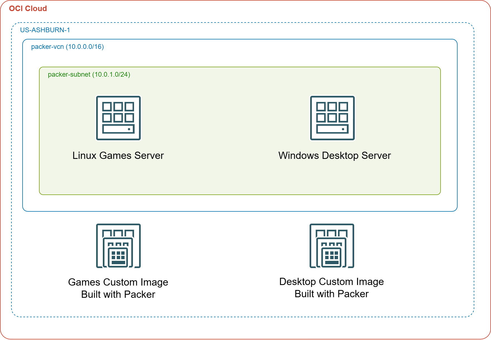
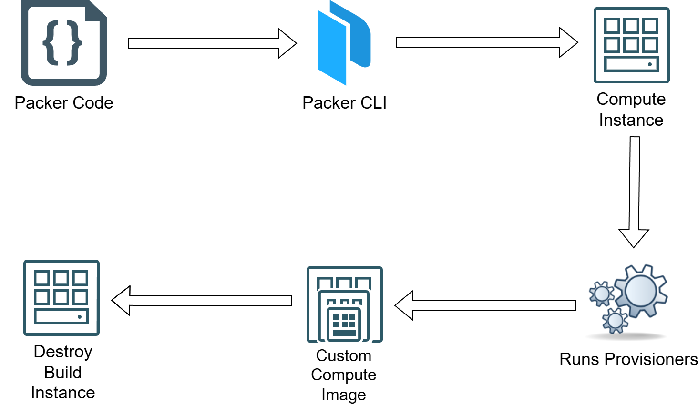

# Building Custom Images with Packer in OCI

In the OCI solution, we use Packer to build both **Linux images** and **Windows images** as OCI Custom Images.

- For **Linux**, we configure an Ubuntu 24.04 image with Apache and deploy several retro HTML games. The source for the HTML games can be found at [https://gist.github.com/straker](https://gist.github.com/straker)
- For **Windows**, we install Chrome and Firefox, apply the **latest Windows Updates**, and configure WinRM using a **cloudbase-init user data script**.



We use **cloudbase-init** to reset instance state on each deployment — the OCI equivalent of EC2Launch Sysprep — ensuring a clean, reusable image every time.

The images are built inside a **VCN and subnet** provisioned by Terraform in Phase 1.

We test deployments by accessing the Linux instance over **HTTP (port 80)** and the Windows instance via **RDP** using a local `packer` account with a secure password.

**Windows is optional** — set `BUILD_WINDOWS=false` before running `apply.sh` to skip the Windows build and deployment entirely.

## Packer Workflow



## Prerequisites

* [An OCI Account](https://cloud.oracle.com/)
* [Install OCI CLI](https://docs.oracle.com/en-us/iaas/Content/API/SDKDocs/cliinstall.htm) and run `oci setup config`
* [Install Latest Terraform](https://developer.hashicorp.com/terraform/install)
* [Install Latest Packer](https://developer.hashicorp.com/packer/install)
* [Install jq](https://stedolan.github.io/jq/download/)

Set your compartment OCID before running:

```bash
export OCI_COMPARTMENT_ID="ocid1.compartment.oc1..aaaa..."
```

If `OCI_COMPARTMENT_ID` is not set, the scripts fall back to the tenancy OCID read from `~/.oci/config`.

## Download this Repository

```bash
git clone https://github.com/mamonaco1973/oci-packer.git
cd oci-packer
```

## Build the Code

Run [apply.sh](apply.sh) — it calls [check_env.sh](check_env.sh) first.

```bash
~/oci-packer$ ./apply.sh
NOTE: Validating that required commands are found in your PATH.
NOTE: oci is found in the current PATH.
NOTE: packer is found in the current PATH.
NOTE: terraform is found in the current PATH.
NOTE: jq is found in the current PATH.
NOTE: All required commands are available.
NOTE: Successfully connected to OCI.
NOTE: Applying networking infrastructure
NOTE: Building Linux image
NOTE: Building Windows image
NOTE: Deploying compute instances
```

To skip the Windows build and deploy only Linux:

```bash
BUILD_WINDOWS=false ./apply.sh
```

### Build Process Overview

The build process is divided into three phases:

1. **Phase 1 — Networking (`01-infrastructure`):** Terraform provisions a VCN, IGW, route table, security list, and subnet. An ECDSA SSH key pair and a random `packer` password are generated and surfaced as Terraform outputs for subsequent phases.
2. **Phase 2 — Packer Builds (`02-packer`):** Packer builds the Linux `games` image and (optionally) the Windows `desktop` image using the subnet from Phase 1. This phase takes the longest — at least 20 minutes including Windows Updates.
3. **Phase 3 — Deploy (`03-deploy`):** Terraform creates OCI compute instances from the custom images produced in Phase 2.

## Test the Games Server

Navigate to the public IP of the deployed Linux instance in a web browser:

```
http://<games_server_ip>
```

You can also SSH to the instance using the generated key:

```bash
ssh -i 01-infrastructure/keys/Private_Key ubuntu@<games_server_ip>
```

## Test the Desktop Server

Create an RDP session to the Windows instance public IP. When prompted for credentials, use:

- **Username:** `packer`
- **Password:** retrieve with `terraform -chdir=03-deploy output` or from the `packer_password` output of `01-infrastructure`
